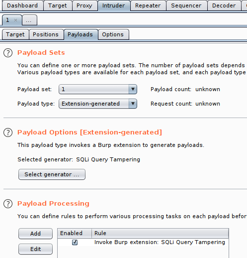
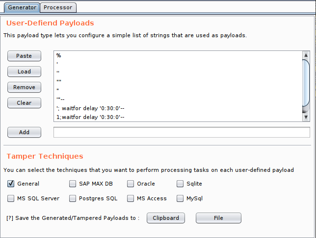
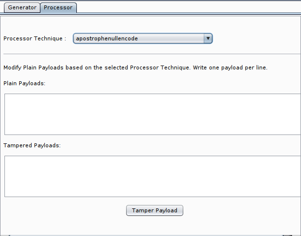

SQLi Query Tampering
==================
SQLi Query Tampering extends and adds custom Payload Generator/Processor in 
Burp Suite's Intruder. 

#### Advantages and Benefits
Sqlmap is a great automated tool for SQL vulnerabilities but it can be a little
noisy when you perform pentesting or bug hunting!
One of the cool part of Sqlmap is Tampering. Tampering gives us some
functions/techniques to evade filters and WAF's.

SQLi Query Tampering gives you the flexibility of manual testing with many powerful
evasion techniques. This extension has two part:

1. Generator: 
   - You are able to add your customized payloads
   - All evasion techniques grouped by DBMS type
   - Tampered payloads can be used as a Generator in Intruder or saved to clipboard/file

2. Processor: 
   - You have the ability to choose on of the tamper techniques as your processor
   - The processor can be added as a Payload Processor
   - You can add your payloads and tamper them based on the selected technique. Write one payload per line.

The list of Evasion Techniques:

> apostrophemask, apostrophenullencode, appendnullbyte, between, bluecoat, 
> chardoubleencode, charencode, charunicodeencode, charunicodeescape, commalesslimit,
> commalessmid, commentbeforeparentheses, concat2concatws, equaltolike, escapequotes,
> greatest, halfversionedmorekeywords, hex2char, htmlencode, ifnull2casewhenisnull,
> ifnull2ifisnull, informationschemacomment, least, lowercase, modsecurityversioned,
> modsecurityzeroversioned, multiplespaces, overlongutf8, overlongutf8more, 
> percentage, plus2concat, plus2fnconcat, randomcase, randomcomments, sp_password, 
> space2comment, space2dash, space2hash, space2morecomment, space2morehash, 
> space2mssqlblank, space2mssqlhash, space2mysqlblank, space2mysqldash, space2plus, 
> space2randomblank, symboliclogical, unionalltounion, unmagicquotes, uppercase, 
> versionedkeywords, versionedmorekeywords, 0eunion, misunion, schemasplit, binary,
> dunion

#### Requirements:
- Burp Suite Professional
- Jython 2.7 standalone: http://www.jython.org/downloads.html

#### Manual installation:

1. `Extender` -> `Options`
2. Click `Select file` under `Python environment`
3. Choose jython-standalone-2.5.jar
4. `Extender` -> `Extensions`
5. Click `Add`
6. Change `Extension Type` to Python
7. Choose `sqli_query_tampering.py`
8. Done!

#### Usage notes:
- All Tampered Queries (in Generator/Processor) returned in URL-Encoded
- You can add a decode rule in Payload Processing section if you need URL-decoded payloads

#### Changelog:
**1.1:**
  - Add tamper techniques:
    - 0eunion: Replaces instances of `<int> UNION` with `<int>e0UNION`
    - misunion: Replaces instances of `UNION` with `-.1UNION`
    - schemasplit: Replaces instances of `DBName.TableName`  with `DBName 9.e.TableName`
    - binary: Injects keyword binary where possible
    - dunion: Replaces instances of `<int> UNION` with `<int>DUNION`
  
**1.0:**
  - Release